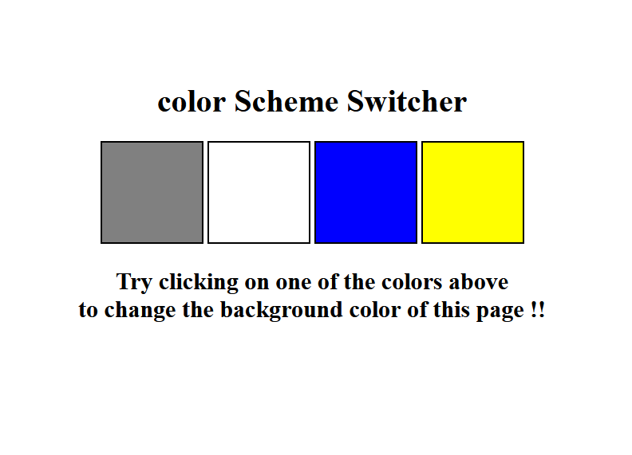
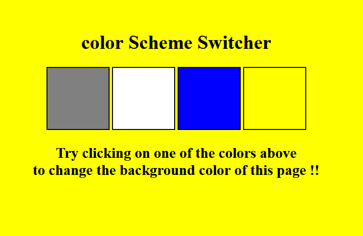
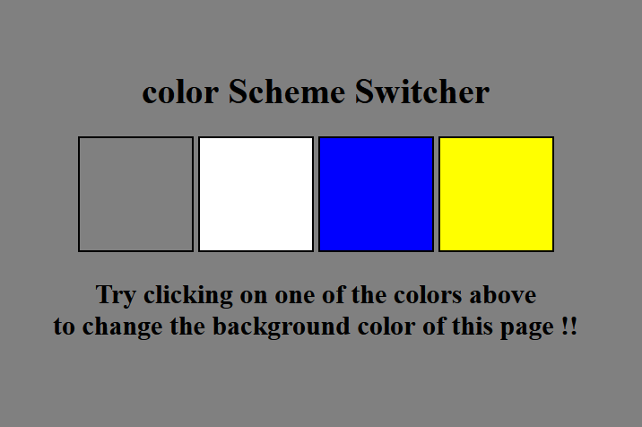

# <b> This repo have some Javascripts Basic Projects</b> </br> </br>  </br>
# <u>Project 1 :- Color Scheme Switcher :-</u>
# <u>Snapshot of the Color Scheme Switcher Project</u>
### Here is a snapshot of the project :-

<br>

<br>


## In the Color Scheme Switcher Project i can used <b><u> DOM and If condition and also Switch Case</u> </b> to change the the background color with respect to its item .
### <u># I can used following steps to change color :- </u>

### 1  :- I can select the different buttons using <strong><u>querySelectorAll</u></strong> and code is :-
```javascript
const buttons = document.querySelectorAll('.button');
// console.log(buttons)
```
### 2:- In this step i can select the body with <strong><u> querySelector </u><stronng> code is :-
```javascript
const body = document.querySelector("body");
// console.log(body)
```
### 3:- In the third step i can use <strong><u>foreach loop</u></strong> for select all buttons :-
```javascript
buttons.forEach(function (button){
console.log(button);

//.....codes....

});
```
### 4:- Now i can add the <strong><u>addEventListener()</u></strong> for change the background color using following logic :-
```javascript
button.addEventListener('click',function(e){
    console.log(e);
    console.log(e.target);
    //....codes...
    });
```
### 5:- Change background color with follwing logic:-
## If( ) statement :-
```javascript
//change bg color to grey using if statement

    if(e.target.id ==='grey'){
        // body.style.backgroundColor = 'grey';
        body.style.backgroundColor = e.target.id;
    }
```
## switch case :-
```javascript
//change bg color to grey using switch case 

switch(e.target.id){
    case'grey' :
        body.style.backgroundColor = e.target.id;  
}

```

# <u>Conclusion</u>:-
### By following the steps outlined above, you can create a basic Color Scheme Switcher project using JavaScript. This project demonstrates how to manipulate the DOM, handle user interactions, and apply conditional logic with if statements and switch cases. 

# <u>Next Steps</u>:-
## You can extend this project by adding more color options, animating the transitions, or even saving the user's color preference using local storage. <u>Feel free to experiment and make this project your own !!!
